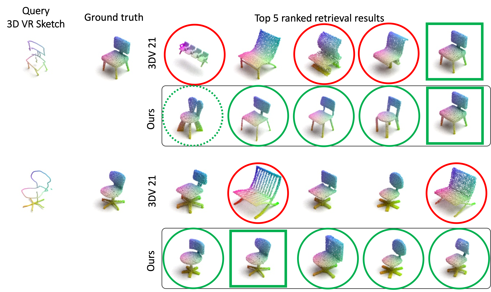
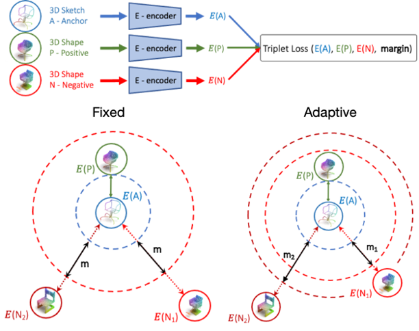

# Structure-Aware 3D VR Sketch to 3D Shape Retrieval

This repository contains the Pytorch implementation of the paper: Structure-Aware 3D VR Sketch to 3D Shape Retrieval, accepted by 3DV 2022. ([paper](https://arxiv.org/abs/2209.09043), [supplemental](https://drive.google.com/file/d/11rt_fVuqumWUy_jVMAis4di4KW0bRHJr/view?usp=sharing), [video](https://www.youtube.com/watch?v=osskcgV2lLk&list=PLDqmL95Gm8yIOzgysJgj2riAPNyZna61w&index=7&t=6s&ab_channel=3DV2022))



## Introduction



We study the practical task of fine-grained 3D-VR-sketch-based 3D shape retrieval. This task is of particular interest as 2D sketches were shown to be effective queries for 2D images.
However, due to the domain gap, it remains hard to achieve strong performance in 3D shape retrieval from 2D sketches. 
Recent work demonstrated the advantage of 3D VR sketching on this task. 
In our work, we focus on the challenge caused by inherent inaccuracies in 3D VR sketches.
We observe that retrieval results obtained with a triplet loss with a fixed margin value, commonly used for retrieval tasks, contain many irrelevant shapes and often just one or few with a similar __structure__ to the query.
To mitigate this problem, we for the first time draw a connection between adaptive margin values and shape similarities.

In particular, we propose to use a triplet loss with an adaptive margin value driven by a "fitting gap", which is the similarity of two shapes under structure-preserving deformations.
We also conduct a user study which confirms that this fitting gap is indeed a suitable criterion to evaluate the structural similarity of shapes. 

Furthermore, we introduce a dataset of 202 VR sketches for 202 3D shapes drawn from memory rather than from observation.

## Dataset

- [Fine-Grained VR Sketching: Dataset and Insights](https://cvssp.org/data/VRChairSketch/) for trianing, validation and testing.
- [Sketch from memory dataset](https://drive.google.com/file/d/1lwofDAX-_z4rHebsmHJiYUd4Tui_jFIT/view?usp=sharing) (for testing only): 202 VR sketches for 202 3D shapes drawn from memory rather than from observation. 

Once downloaded, please extract to 'project/data'.

## Environments
This project is based on Pytorch Lightning.

```
conda env create -f environment.yaml
conda activate structure
```

## Usage

### For easy inference

All pretrained models (deformer and retrieval) for chair(03001627) can be dowloaded [here](). Please download it and place inside 'project/logs/'. Then run inference by:

```

```

If you want to train from scratch, please follow the intructions below:

### Step 1: Train Deformer

You can train deformer for any specif category like lamp(03636649), and ariplane category(02691156) of ShapeNet by claiming `++datamodule.category==CATEGORY_ID`.
```shell
category = 03636649
name = template_$(category)
JobBatchName = $(config)_$(name)

python project/run.py name=$(JobBatchName) experiment=deformer_cage_sh2sh_shapenet ++datamodule.category=$(category) resume_training=True

```

### Step 2: Compute Fitting Gap

```shell
category = 03636649
python project/val_sh2sh.py
```
Precomputed fitting gap files for chair category can be dowloaded [here]().

### Step 3: Train

```

```

## Contact

If you have any questions about this project please feel free to open an issue or contact Ling Luo at ling.rowling.luo@gmail.com.

## Cite
If you find this work useful, please consider citing our work:

## Acknowledgement

Our project is built upon the following work:

- [KeypointDeformer: Unsupervised 3D Keypoint Discovery for Shape Control](https://github.com/tomasjakab/keypoint_deformer)
